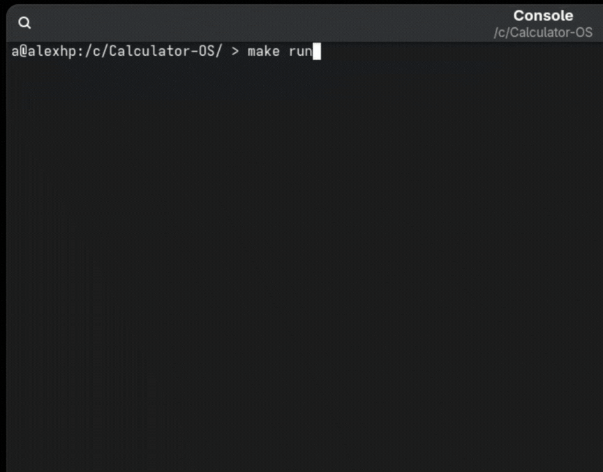

# Calculator OS

A minimal operating system that boots directly to a simple calculator.



## Features

- Boots directly from BIOS
- Minimal memory footprint
- Supports basic arithmetic operations (+, -, *, /)
- Text-based VGA interface

## Prerequisites

To build and run this OS, you'll need:

- gcc (with 32-bit support)
- nasm
- ld (GNU linker)
- qemu-system-i386 (for testing)
- make

On Ubuntu/Debian, you can install these with:

```
sudo apt-get update
sudo apt-get install gcc-multilib nasm build-essential qemu-system-x86
```

## Running

To run the OS in QEMU, use:

```
make run
```

Or manually:

```
qemu-system-i386 -fda os.img
```

## Benchmarks
On my machine, the total compilation and boot times are:
```
a@alexhp:/c/Calculator-OS/ > nix-shell -p nasm gcc binutils qemu hyperfine xdotool --run "make benchmark"
Compilation Time
Benchmark 1: make all > /dev/null 2>&1
  Time (mean ± σ):     133.3 ms ±  33.7 ms    [User: 75.4 ms, System: 56.1 ms]
  Range (min … max):    96.2 ms … 190.6 ms    10 runs
 
Boot Time
Benchmark 1: ./measure_boot_time.sh
  Time (mean ± σ):      79.2 ms ±  16.9 ms    [User: 71.7 ms, System: 47.9 ms]
  Range (min … max):    59.5 ms … 107.3 ms    10 runs
```

## Usage

Once booted, you'll see a calculator prompt. Type a simple arithmetic expression like:

- `5+3`
- `10-2`
- `6*7`
- `8/2`

Then press Enter to calculate the result.

- Press ESC to clear the current input
- Backspace to delete the last character

## Building

To build the OS, simply run:

```
make
```

This will create `os.img`, which is a bootable floppy disk image.

## How It Works

The system consists of:

1. A 512-byte bootloader that loads the kernel
2. A minimal kernel written in C that implements the calculator
3. Direct hardware access for keyboard input and screen output

There is no operating system in the traditional sense - the calculator IS the OS.

## License

This project is licensed under the MIT License - see the [LICENSE](LICENSE) file for details.